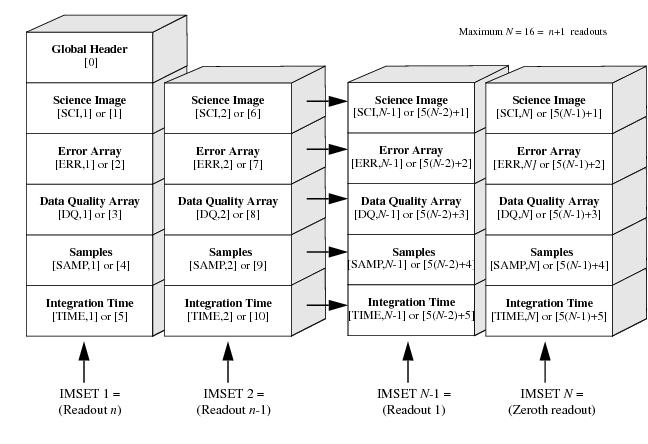

******
calwf3
******

`calwf3` is the name of the  main executable which processes data from the WFC3 instrument onboard Hubble taken with either the UVIS or IR detectors. The code is organized into subtasks that the main `calwf3` calls appropriately. Users may run the subtasks independently if they desire special processing for their datasets. :ref:`wf3cte`, :ref:`wf3ccd` and :ref:`wf32d` are used for processing UVIS images, while IR image processing is done with :ref:`wf3ir`. The :ref:`wf3rej` program is used for both UVIS and IR images to combine multiple exposures contained in a CR-SPLIT or REPEAT-OBS set. :num:`Figure#calflow` is the flow diagram for the UVIS pipeline as a whole, while :num:`Figure#irflow` contains the flow for the IR pipeline.

.. note::

    During automatic pipeline processing by the STScI archive, `Astrodrizzle` follows `calwf3`. All calibrated images are corrected for geometric distortion and associated sets of dithered images are combined into a single product. See the WFC3 Data Handbook for more information, or `Astrodrizzle <http://www.stsci.edu/hst/HST_overview/drizzlepac/>`_ .

Where to Find calwf3
====================

`calwf3` is part of HSTCAL package, which can be downloaded separately from its GIT repository in the `Spacetelescope <https://github.com/spacetelescope/hstcal>`_ area.  It's binaries are also installed along with the STScI distributed package `Astroconda <http://astroconda.readthedocs.io/en/latest/installation.html>`_ .

A detailed description of the improvements in `calwf3 v3.3`, which is more generally referred to as the UVIS2.0 update, can be found in the `February 22, 2016 issue of the STAN <http://www.stsci.edu/hst/wfc3/documents/newsletters/STAN_02_23_2016#STANIssue22-CALWF3Version3.3>`_.

The current WFC3 Data Handbook can be found at  http://www.stsci.edu/hst/wfc3/documents/handbooks/currentDHB/ .
In the meantime, if you have questions not answered in this documentation, please contact STScI Help Desk (help[at]stsci.edu).
You may also submit a github issue for either the HSTCAL or WFC3TOOLs repositories.

.. note::

    In order to see what version of calwf3 you are running locally, you can issue the following shell commands:

    .. code-block:: shell

        calwf3.e -r  --> returns the full version string
        Current version: 3.4(28-Sep-2016)

        calwf3.e --version --> returns just the version number itself.
        3.4

Running calwf3
==============

`calwf3` can be run on a single input raw file or an asn table listing the members of an association.
When processing an association, it retrieves calibration switch and reference file keyword settings from
the first image listed in the asn table. `calwf3` does not accept a user-defined list of input images on the
command line (e.g. ``*raw.fits`` to process all raw files in the current directory).

The :ref:`wf3ccd`, :ref:`wf32d`, :ref:`wf3cte` and :ref:`wf3ir` tasks on the other hand, will accept such user-defined input file lists, but they will not accept an association table( asn ) as input.

`HST file naming conventions  <https://archive.stsci.edu/hlsp/ipppssoot.html>`_ has a great description of how files are named and what those names mean.

Running `calwf3` from a python terminal using `wfc3tools`
---------------------------------------------------------

In Python without TEAL:

.. code-block:: python

    from wfc3tools import calwf3
    calwf3(filename)

In Python with TEAL:

.. code-block:: python

    from stsci.tools import teal
    from wfc3tools import calwf3
    teal.teal('calwf3')

Parameter Options
~~~~~~~~~~~~~~~~~
* input: str
    Name of input files
    * a single filename (iaa012wdq_raw.fits)
    * a Python list of filenames
    * a partial filename with wildcards (\*raw.fits)
    * filename of an ASN table (\*asn.fits)
* printtime: bool
    print a detailed time stamp
* save_tmp: bool
    save temporary files
* debug: bool
    print optionsl debugging statements
* parallel: bool
    run the code with OpemMP parallel processing turned on for the UVIS CTE correction
* log_func: func()
    if not specified, the print function is used for logging to facilitate use in the Jupyter notebook
* verbose: bool, optional
    Print verbose time stamps?
* quiet: bool, optional
    Print messages only to trailer file?

In Pyraf:

.. code-block:: python

    import wfc3tools
    epar calwf3

Running many files at the same time
~~~~~~~~~~~~~~~~~~~~~~~~~~~~~~~~~~~

The recommended method for running `calwf3` in batch mode is to use Python and
the `wfc3tools` package in the `Astroconda distribution <http://astroconda.readthedocs.io/en/latest/installation.html>`_ .

For example:

.. code-block:: python

    from wfc3tools import calwf3
    from glob import glob

    for fits in glob('j*_raw.fits'):
        calwf3(fits)

.. note::

   When running in the notebook or from the python wrappers `calwf3()` may raise a RuntimeError if the underlying `calwf3.e` program fails with a non-zero exit code. Review the text output during the calibration call for hints as to what went wrong. Full runtime and error messages are printed to the terminal window and saved in the trailer file (.tra) for every run to help you diagnose the issue.

Displaying output from calwf3 in a Jupyter Notebook
~~~~~~~~~~~~~~~~~~~~~~~~~~~~~~~~~~~~~~~~~~~~~~~~~~~

When calling `calwf3` from a Jupyter notebook or from the python wrappers, informational text output from the underlying `calwf3.e` program will be passed through print as the calibration runs by default, and show up in the user's cell. This behavior can be customized by passing your own function as the `log_func` keyword argument to `calwf3`. As output is read from the underlying program, the `calwf3` Python wrapper will call `log_func` with the contents of each line. (`print` is an obvious choice for a log function, but this also provides a way to connect `calwf3` to the Python logging system by passing the `logging.debug` function or similar.)

If `log_func=None` is passed, informational text output from the underlying program will be ignored, but the program's exit code will still be checked for successful completion.

Command Line Options for the calwf3 executable
----------------------------------------------

`calwf3`  can also be called directly from the OS command line by supplying the executable `calwf3.e`
with an input file and a list of options. This is the same executable that the wfc3tools package calls.

.. code-block:: shell

    calwf3.e -vts iaa012wdq_raw.fits

    input: str
        Name of input files
            a single filename (``iaa012wdq_raw.fits``)
            the filename of an ASN table (``*_asn.fits``)

        -t : print a detailed time stamp
        -s : save temporary files
        -d : print optional debugging statements
        -1 : suppress the OpemMP parallel processing for the UVIS CTE correction
        -v : Print verbose time stamps and information
        -q : Print messages only to trailer file

Running many files at the same time
~~~~~~~~~~~~~~~~~~~~~~~~~~~~~~~~~~~

The command line executable only accepts one file at a time, but you can use operating system tools like `awk` to process everything in a directory:

.. code-block:: shell

    ls *raw.fits | awk '{print "calwf3.e",$1}' | csh

Types of files used as input to calwf3
--------------------------------------

* _asn file: name of an association table
* _raw file: name of an individual, uncalibrated exposure
* _crj file: name of any sub-product from an association table

While both CR-SPLIT and REPEAT-OBS exposures from an association get combined using `calwf3`, dithered observations from an association will be combined using `Astrodrizzle <http://www.stsci.edu/hst/HST_overview/drizzlepac/>`_. Images taken at a given dither position can be additionally CR-SPLIT (UVIS only) into multiple exposures.

When `calwf3` is given an input file, it first discovers which of the above types of files it has provided; a single image, an association table, or a product from an association table. It will then make sure the specified input exists. It then checks to see which DETECTOR the data was observed with and calls the appropriate processing pipeline, either UVIS or IR.

Association Tables
~~~~~~~~~~~~~~~~~~
An association file has a single extension that is a binary FITS table. That table has three columns
where the member names (MEMNAME), member types (MEMTYPE), the role which that member plays in the
association and a boolean value for whether the member is present (MEMPRSNT) are displayed. The present value for the product shows "yes" because the data has already been processed and the table updated. `calwf3` will check for the existence on disk of each member and then record it's type and any products which will be produced from the association.

========  =====================================================================
MEMTYPE               DESCRIPTION
========  =====================================================================
EXP-CRJ   An input CR-SPLIT exposure
EXP-CRn   An input CR-SPLIT exposure for CR-combined image n (multiple sets)
PROD-CRJ  CR-combined output product from a single set
PROD-CRn  CR-combined output product n from multiple sets
EXP-RPT   An input REPEAT-OBS exposure for a single set
EXP-RPn   An input REPEAT-OBS exposure for repeated image n
PROD-RPT  An output product for a REPEAT-OBS combined single set
PROD-RPn  REPEAT-OBS combined output product n from multiple sets
EXP-DTH   An input dithered exposure
PROD-DTH  A dither-combined output product
========  =====================================================================

In order to create a geometrically correct, drizzle-combined product, PROD-DTH
exposures are combined only with Astrodrizzle, which executes after `calwf3` has
finished processing all members.

PROD-RPT and PROD-CRJ products are combined useing :ref:`wf3rej` and all output files
have the cr? extension.

Here's an example of what an association table might contain:

.. code-block:: shell

    #  Table iacr51010_asn.fits[1]  Tue 15:23:02 25-Apr-2017

    # row MEMNAME        MEMTYPE        MEMPRSNT
    #

        1 IACR51OHQ      EXP-RP1        yes
        2 IACR51OJQ      EXP-RP1        yes
        3 IACR51OKQ      EXP-RP2        yes
        4 IACR51OMQ      EXP-RP2        yes
        5 IACR51010      PROD-DTH       yes
        6 IACR51011      PROD-RP1       yes
        7 IACR51012      PROD-RP2       yes

The association file has four REPEAT-OBS exposures and instructs calwf3 to
make three products, one for RP1 members, one for RP2 members and one dither
combination for all of the members.

The IACR51010 will be produced by Astrodrizzle. The IACR51011 and IACR51012 products
will be produced by calwf3 using `wf3rej`.

Intermediate Files
~~~~~~~~~~~~~~~~~~
When `calwf3` determines that an intermediate product has been given as input, the
preferred method is for users to call the stand-alone tasks by hand. However, it will
default to looking for the ASN_TAB keyword in the file header and will partially
process the table that is specified.

Single Files
~~~~~~~~~~~~
For single exposure processing, CRCORR and RPTCORR are  set to OMIT,
but otherwise, `calwf3` obeys the processing keywords in the image header.

UVIS Data FITS format
~~~~~~~~~~~~~~~~~~~~~

.. _uvis_data_format:

.. figure:: ../_static/uvis_data_format.png
    :align: center
    :alt:  UVIS data raw file format

    UVIS data raw file format

IR Data FITS Format
~~~~~~~~~~~~~~~~~~~
The input FITS file for the IR detector data contains multiple extensions in groups
of five, where each exposure has an extension that details the science image itself,
the error associated with each pixel, data quality flags for the pixel, the number of
samples used to calculate the pixel signal, and the accumulated integration time for
each pixel. The final output file contains only five extensions, each containing the
final values for the entire set of exposures as related to the slope image in the science
extension.

.. _ir_data_format:

    IR data raw file format

* The science image contains the data from the focal plane array detectors.
* The error array contains an estimate of the statistical uncertainty associated with each corresponding science image pixel
* The data quality array contains independent flags indicating various status and problem conditions associated with each corresponding pixel in the science image
* The sample array (IR ONLY) contains the number of samples used to derive the corresponding pixel values in the science image.
* The time array (IR ONLY) contains the effective integration time associated with each corresponding science image pixel value.

Types of output files from calwf3
---------------------------------

The suffixes used for WFC3 raw and calibrated data products closely mimic those used by ACS and NICMOS:

========   =================================================    ====================
SUFFIX     DESCRIPTION                                          UNITS
========   =================================================    ====================
_raw       raw data                                             DN
_rac       UVIS CTE corrected raw data, no other calibration    DN
_asn       association table for observation set
_spt       telescope and WFC3 telemetry and engineering data
_blv_tmp   overscan-trimmed UVIS exposure                       DN
_blc_tmp   overscan-trimmed UVIS, CTE corrected exposure        DN
_crj_tmp   uncalibrated, cosmic-ray rejected combined           DN
_crc_tmp   uncalibrated, cosmic-rat rejected, CTE cleaned       DN
_ima       calibrated intermediate IR multiaccum image          :math:`e^{-}/s`
_flt       UVIS calibrated exposure                             :math:`e^{-}`
_flc       UVIS calibrated exposure including CTE correction    :math:`e^{-}`
_flt       IR calibrated exposure                               :math:`e^{-}/s`
_crj       UVIS calibrated, cosmic ray rejected image           :math:`e^{-}`
_crj       IR calibrated, cosmic ray rejected image             :math:`e^{-}/s`
_crc       UVIS calibrated, CR rejected, CTE cleaned image      :math:`e^{-}`
.tra       trailer file, contains processing messages
========   =================================================    ====================

** DRZ and DRC products are produced with Astrodrizzle, see `Astrodrizzle <http://www.stsci.edu/hst/HST_overview/drizzlepac/>`_ **

Keyword Usage
-------------

`calwf3` processing is controlled by the values of keywords in the input image headers. Certain keywords, referred to as calibration switches, are used to control which calibration steps are performed. Reference file keywords indicate which reference files to use in the various calibration steps. Users who wish to perform custom reprocessing of their data may change the values of these keywords in the `_raw` FITS file primary headers and then rerun the modified file through  `calwf3`. See the `WFC3 Data Handbook <http://www.stsci.edu/hst/wfc3/documents/handbooks/currentDHB/wfc3_Ch25.html>`_ for a more complete description of these keywords and their values.

Using CRDS to update your reference files
~~~~~~~~~~~~~~~~~~~~~~~~~~~~~~~~~~~~~~~~~
CRDS is the reference file management software used by STSCI for organizing and assigning reference files to datasets.
Users can query CRDS to get the best references files for their data at hand. The following link details how you
can use this locally : `Using CRDS to find the best reference files for your data <https://hst-crds.stsci.edu/bestrefs/>`_

.. include:: ./uvis_pipeline.inc

.. include:: ./ir_pipeline.inc
