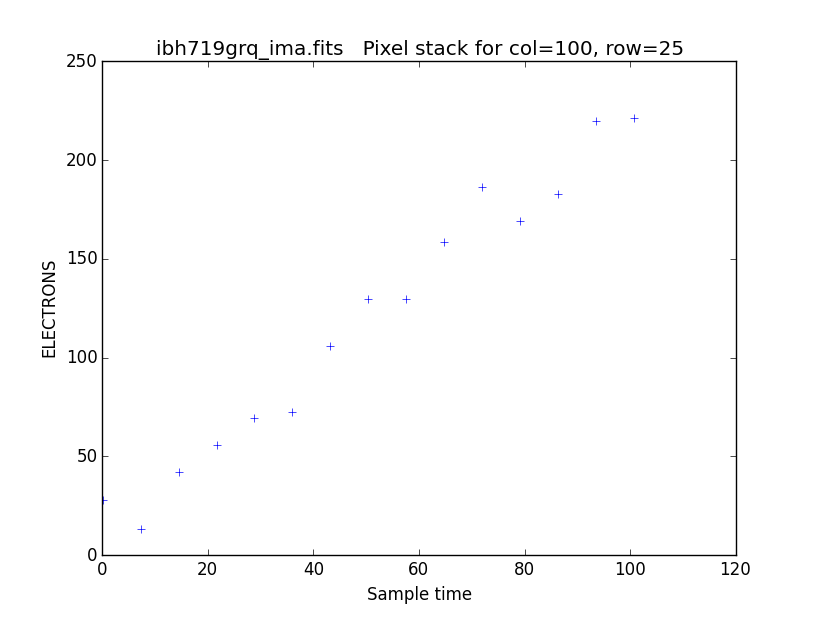

.. _pstack:

******
pstack
******

Plot the stack of MultiAccum sample values for a specified pixel  in an
IR multiaccum image.  Pixels from any of the SCI, ERR, DQ, or TIME image
extensions can be plotted.  The total number  of
samples  is determined from the primary header keyword NSAMP and all
samples (excluding the zeroth read) are plotted.  The SCI, ERR,  DQ,
values are plotted as a function of sample time, while TIME
values are plotted as a  function  of  sample  number.   The  sample
times  are read from the SAMPTIME keyword in the SCI header for each
readout. If any of the ERR, DQ, SAMP, or TIME extensions have  null
data  arrays,  the value of the PIXVALUE extension header keyword is
substituted for the pixel values.  The plotted data  values  can  be
saved to an output text table or printed to the terminal.

The BUNIT keyword value is used to determine the starting units of the data,
but you can plot either counts or rate using the optional keyword ``units``.

.. Warning::
    Note that the arrays are structured in SCI order, so the final exposure is the first element in the array

Parameters
==========

* filename : str
    Input MultiAccum image name.  This should be either  a  _ima  or _raw  file, containing all the data from multiple readouts.  You must specify just the file name, with no extension designation.

* column : int, default=0
    The column index of the pixel to be plotted.

* row : int, default=0
    The row index of the pixel to be plotted.

* extname : str, default="sci"
   Extension name (EXTNAME keyword value) of data to plot. Allowed values are "sci", "err", "dq", "samp", and "time".

* units : str, default="counts"
   Plot "sci" or  "err"  data  in  units  of  counts  or  countrate ("rate").   Input data can be in either unit; conversion will be performed automatically.  Ignored when  plotting  "dq",  "samp", or "time" data. Allowed values are "counts" and "rate".

* title : str, default=None
   Title  for  the  plot.   If  left  blank,  the name of the input image, appended with  the  extname  and  column  and  row  being plotted, is used.

* xlabel : str, default=None
   Label  for  the  X-axis  of the plot.  If left blank, a suitable default is generated.

* ylabel : str, default=None
   Label for the Y-axis of the plot.  If  left  blank,  a  suitable default  based  on the plot units and the extname of the data is generated.

* plot : bool, default=True
    If False, return data and do not plot.

Returns
=======

* xaxis : numpy.ndarray
   Array of x-axis values that will be plotted.

* yaxis : numpuy.ndarray
   Array of y-axis values that will be plotted as specified by 'units'.

Usage
=====

.. code-block:: python

    from wfc3tools import pstack
    xdata,ydata=pstack(inputFilename,column=x,row=y,extname="sci",units="counts",title="",ylabel="",xlabel="")

Example Output
==============

::

    In [1]: xdata,ydata=pstack.pstack('ibh719grq_ima.fits',column=100,row=25,extname='sci')

The plotting data is returned as two arrays, to save them into variables issue the command as above:

::

    In [1]: xdata
    Out[2]:
    array([ 100.651947,   93.470573,   86.2892  ,   79.107826,   71.926453,
             64.745079,   57.563702,   50.382328,   43.200954,   36.019581,
             28.838205,   21.65683 ,   14.475455,    7.29408 ,    0.112705,
              0.      ])

    In [3]: ydata
    Out[4]:
    array([ 221.36606389,  219.5396653 ,  182.63100095,  169.178308  ,
            186.44084352,  158.3105126 ,  129.46997895,  129.92935701,
            106.14521852,   72.71721539,   69.68652119,   55.98828663,
             42.30755279,   13.12659422,   27.71404187,    0.        ])
