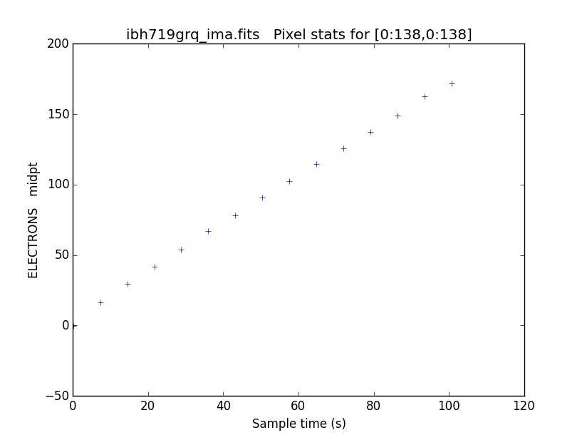

.. _pstat:

*****
pstat
*****

Plot statistics for a specified image section  up  the  stack  of  a
an IR MultiAccum image.  Sections from any of the SCI,
ERR, DQ,  image extensions can be  plotted.   A  choice
of  mean,  median,  mode,  standard  deviation,  minimum and maximum
statistics is available.  The total number of samples is  determined
from  the  primary  header  keyword NSAMP and all samples (excluding
the zeroth-read) are plotted.  The SCI, ERR, DQ  statistics
are  plotted as a function of sample time. The sample times  are  read
from  the  SAMPTIME  keyword in the SCI header for each readout.

SAMP and TIME aren't generally populated until the FLT image stage
To plot the samptime vs sample, use wfc3tools.pstat and the "time" extension

    An example of the default plot from pstat

::

    In [1]: pstat('ibh719grq_ima.fits')

The plotting data is returned as two arrays:

::

    Out[2]:
    (array([ 100.651947,   93.470573,   86.2892  ,   79.107826,   71.926453,
              64.745079,   57.563702,   50.382328,   43.200954,   36.019581,
              28.838205,   21.65683 ,   14.475455,    7.29408 ,    0.112705,
               0.      ]),
     array([ 171.85813415,  162.44643275,  148.99918831,  137.60458714,
             125.91510743,  114.71149769,  102.63038466,   90.97130078,
              78.26479365,   67.16825321,   53.6897243 ,   41.71639092,
              29.36628817,   16.47151355,   -0.20821257,    0.        ]))

If you want to save the plotting data into the variables ``time`` and ``counts`` you can issue the command like this:

::

    In [1]: time,counts =pstat.pstat('ibh719grq_ima.fits')

    In [2]: time
    Out[3]:
    array([ 100.651947,   93.470573,   86.2892  ,   79.107826,   71.926453,
             64.745079,   57.563702,   50.382328,   43.200954,   36.019581,
             28.838205,   21.65683 ,   14.475455,    7.29408 ,    0.112705,
              0.      ])

    In [4]: counts
    Out[5]:
    array([ 171.85813415,  162.44643275,  148.99918831,  137.60458714,
            125.91510743,  114.71149769,  102.63038466,   90.97130078,
             78.26479365,   67.16825321,   53.6897243 ,   41.71639092,
             29.36628817,   16.47151355,   -0.20821257,    0.        ])

.. Warning::
    Note that the arrays are structured in SCI order, so the final exposure is the first element in the array

Parameters
==========

* filename [file]
    Input   MultiAccum   image  name  with  optional  image  section  specification.  If no image section  is  specified,  the  entire image  is  used.   This  should  be  either a _raw or _ima file, containing all  the  data  from  multiple  readouts.   You  must specify  just  the  file name and image section, with no extname designation.

* extname = "sci" [string, allowed values: sci | err | dq ]
    Extension name (EXTNAME keyword value) of data to plot.
* units = "counts" [string, allowed values: counts | rate]
    Plot "sci" or  "err"  data  in  units  of  counts  or  countrate
    ("rate").   Input data can be in either unit; conversion will be
    performed automatically.  Ignored when  plotting  "dq",  "samp",
    or "time" data.

* stat = "midpt" [string, allowed values: mean|midpt|mode|stddev|min|max]
    Type of statistic to compute.

* title = "" [string]
   Title  for  the  plot.   If  left  blank,  the name of the input
   image, appended with the extname and image section, is used.

* xlabel = "" [string]
   Label for the X-axis of the plot.  If  left  blank,  a  suitable
   default is generated.

* ylabel = "" [string]
   Label  for  the  Y-axis  of  the plot. If left blank, a suitable
   default based on the plot units and the extname of the  data  is
   generated.

* plot = True [bool]  set plot to false if you only want the data returned

Usage
=====

pstat.py  inputFilename [pixel range]

.. code-block:: python

    from wfc3tools import pstat
    pstat(inputFilename,extname="sci",units="counts",stat="midpt",title="",xlabel="",ylabel="" )
