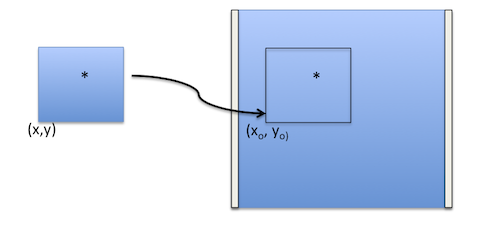

.. sub2full:

********
sub2full
********

Given an image specified by the user which contains a subarray readout, return the location of the corner of the subarray in a full frame reference image (including the full physical extent of the chip), in 1-indexed pixels. If the user supplies an X and Y coordinate, then the translated location of that point will be returned.

Parameters
==========

* filename : str or list
    Input image name or list of image names. The rootname will be used to find the _SPT files in the same directory, the SPT file has all the necessary information for the transform.

* x : int, optional, default=None
    Specify an x coordinate in the subarray to translate. If an x and y are specified, the fullExtent option is turned off and only the translated x,y coords are returned.

* y : int, optional, default=None
    Specify a y coordinate in the subarray to translate. If an x and y are specified, the fullExtent option is turned off and only the translated x,y coords are returned.

* fullExtent : bool, optional, default=False
    If True, the returned values will include the full extent of the subarray in the reference image, for example: (x0,x1,y0,y1).

Returns
=======

* coords : list
    A list of tuples which specify the translated coordinates, either
    (x0,y0) for each image or the full extent sections.

Usage
=====

.. code-block:: python

    from wfc3tools import sub2full
    coords = sub2full(filename,x=None, y=None,fullExtent=False)

Example Output
==============

Default output:

::

    > sub2full('ibbso1fdq_flt.fits')
    > [(3584.0, 1539)]

Optional output:

* Specify a list of images:

::

    > im = ['ic5p02e0q_spt.fits',
           'ic5p02e1q_spt.fits',
           'ic5p02e2q_spt.fits',
           'ic5p02e3q_spt.fits',
           'ic5p02e4q_spt.fits']

    > sub2full(im)
    > [(1062.0, 1363),
      (1062.0, 1363),
      (1410.0, 1243),
      (1410.0, 1243),
      (1402.0, 1539)]

* Return the full extent of the subarray:

::

    > sub2full('ibbso1fdq_flt.fits',fullExtent=True)
    > [(3584.0, 4096, 1539, 2050)]

More information on header keywords
===================================

The task uses header keywords from the SPT file of the associated image in order to calculate the offset for the subarray.
The keywords it uses are:

=========  ====================================
Keyword    Meaning
=========  ====================================
SS_DTCTR   To get the detector for the image
SS_SUBAR   To make sure the image is a subarray
XCORNER    The x corner of the subarray
YCORNER    The y corner of the subarray
NUMROWS    Subarray x size
NUMCOLS    Subarray y size
=========  ====================================

The  UVIS full frame detector has 2051 rows, with 25 pixels of serial overscan. The IR detector has 1024 rows and 5 pixels of overscan.
